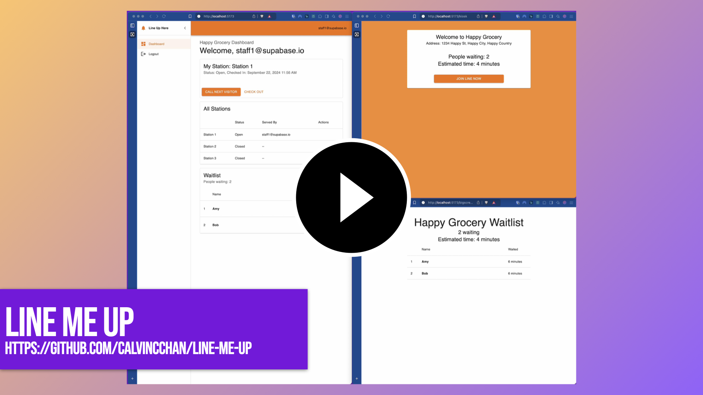

# Line Me Up

## Description

This is a simple waitlist management system for restaurants, retail stores, or any other business that need visitors to line up for services. It allows visitors to add themselves to a waitlist at a kiosk or on their own mobile device. Multiple staffs can handle the waitlist simultaneously. The system will notify visitors when it's their turn.

Introduction video:

Line Me Up is built with [Supabase](https://supabase.io) as the backend and [refinejs](https://refine.dev) as the frontend.

## Installation for Local Testing

1. Clone the repository.

2. Prepare the backend Supabase. To run supabase locally, first follow the guide to install [Supabase CLI](https://supabase.com/docs/guides/cli). After that, follow these steps:

   - `cd supabase`
   - `supabase start` and note the "API URL" and "anon key". You will need these to configure the frontend in the next step. If you need to see the key again, run `supabase status`.
   - `supabase migrations up` to create the database schema.
   - If you just want to quickly test the app, you can run `./scripts/init-demo.sh`. This will create a few stations and a login user for you. You can login with:
     - email: `owner@supabase.io`
     - password: `supabase`

3. Create a `.env` file (or `.env.local` file) in the root of the project.

   - `VITE_SUPABASE_URL` and `VITE_SUPABASE_ANON_KEY` with the values from the previous step.
   - Optionally you can set `VITE_LOCATION_NAME` and `VITE_LOCATION_ADDRESS` to customize the location name and address displayed in the app.

4. Run `npm install` or `yarn install` to install the dependencies.

5. Run `npm dev` or `yarn dev` to start the frontend.

# FUTURE

- [ ] improve and simplify installation
- [ ] Add "Service" attribute to a visit (e.g. "Refund & Exchange", "Delivery", "Dinner", "Pickup", etc.)
- [ ] Support SMS so visitors can get the post-registration link message and "Your turn" notification via SMS.
- [ ] CRUD stations
- [ ] Improve CRUD members
- [ ] Analytics
- [ ] Transfer an active visit to another station

# Self Hosting with Docker

(to be added - how to install and run the whole stack on your own server)
